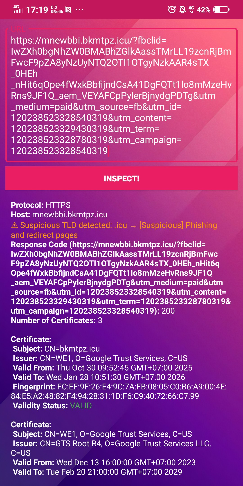

# Test Bae

  

---

**Test Bae** is a fast, online website inspection tool that allows you to analyze and inspect websites instantly. Everything operates online — no data is stored or collected.

---

## Features

- ⚡ Fast, real-time website inspection  
- 🔒 No data collection or user tracking  
- 🎯 Simple and intuitive interface  
- 🪶 Lightweight and efficient  

Additional scanning capabilities:

- Real-time URL scanning  
- SSL/TLS certificate checking  
- Redirect and spoofing detection  
- Phishing pattern detection  
- No logging & no telemetry  

---

## Installation

Download the latest APK from the **Releases** section and install it on any Android device (Android 5.0+).

👉 https://github.com/AdikaraMediaStudio/test-bae/releases

---

## Usage

1. Open the Test Bae app  
2. Enter a website URL  
3. Tap **Inspect**  
4. View detailed analysis instantly  

---

## Contributing

Contributions are welcome!  
Please read the guidelines here:  
📄 `CONTRIBUTING.md`

---

## Support Development

If you find this project useful, consider supporting:

💛 Saweria → https://saweria.co/AdikaraMediaStudio

---

## License

Licensed under the **MIT License** — see [`LICENSE`](LICENSE) for details.

---

## Contact

📧 adikaramedia.studio@gmail.com

---

© 2025 Adikara Media Studio — All Rights Reserved.
